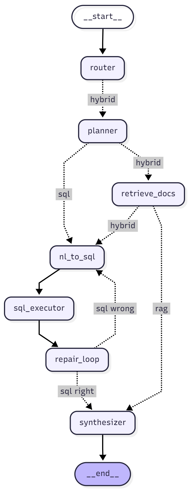

# 🤖 Query Agent


An intelligent multi-modal query agent powered by LangGraph and DSPy that seamlessly handles both RAG (Retrieval-Augmented Generation) and SQL queries from documents and databases, supports questions in both Arabic and English, and provides an interactive GUI built with Streamlit for easy use.



## 📋 Overview

Query Agent intelligently routes user questions to the appropriate data source (files or database) using a 7-node LangGraph workflow. It supports both Arabic and English questions, leverages DSPy for optimized natural language to SQL conversion—significantly reducing token usage while improving accuracy—and offers an interactive Streamlit GUI for a user-friendly experience.


### Key Features

- **🔀 Intelligent Query Routing**: Automatically determines whether to use RAG or SQL based on query analysis
- **📄 Multi-Format Document Support**: Process and query various file formats
- **🗄️ SQL Database Integration**: Natural language to SQL conversion with semantic example selection
- **🎯 DSPy Optimization**: Uses 50 training examples in arabic and english with semantic embeddings to select the 2 most relevant examples for accurate SQL generation
- **🖥️ Interactive GUI**: Built with Streamlit for easy interaction
- **📊 Visual Workflow**: Clear graph representation of the decision-making process

## 🏗️ Architecture

The agent consists of 7 interconnected nodes in a LangGraph workflow:


1. **Router Node**: Determines the optimal path (RAG or SQL or Hybried)
2. **Planer Node**: analyzes the user request and generates a structured, step-by-step plan for how the graph should handle the task
3. **RAG Node**: Retrieves and processes information from documents
4. **SQL Node**: Converts natural language to SQL using DSPy optimization
5. **Execution Node**: Executes queries against the database
6. **repair loop Node**:  attempts to fix invalid SQL queries and retries up to three times before failing.
7. **Synthesis Node**: Combines results and generates final responses


### NL2SQL Optimization with DSPy

The system uses an innovative approach to improve SQL generation:
- Pre-computed embeddings for 50 SQL examples
- Semantic similarity search to find the 2 most relevant examples
- Dynamic schema injection with context-aware examples
- Significant token reduction and accuracy improvement

## 🚀 Getting Started

### Prerequisites

- Python 3.11+
- pip or conda package manager
- Access to a SQL database (PostgreSQL, MySQL, SQLite, etc.)

### Installation

1. **Clone the repository**
```bash
git clone https://github.com/aahmedehab0/Query-Agent.git
cd Query-Agent
git checkout main
```

2. **Create a virtual environment**
```bash
# Using venv
python -m venv venv
source venv/bin/activate  # On Windows: venv\Scripts\activate

# Or using conda
conda create -n query-agent python=3.11
conda activate query-agent
```

3. **Install dependencies**
```bash
pip install -r requirements.txt
```

4. **Set up environment variables**


```bash
$ cp .env.example .env
```

5. **Prepare your data**

- Place your documents in the `assets/files/` folder
- Place your database in the `assets/database/` folder
- Ensure your database is accessible and properly configured


## 💻 Usage

### Running the Streamlit GUI

```bash
streamlit run app.py
```

The interface will open in your browser at `http://localhost:8501`


## 📂 Project Structure

```
├── License
├── README.md
├── app.py
└── src
    ├── .env.example
    ├── .gitignore
    ├── agent
    │   ├── __init__.py
    │   ├── dspy_modules.py
    │   └── graph_nodes.py
    ├── assets
    │   ├── __init__.py
    │   ├── database
    │   │   ├── Chinook_Sqlite.sqlite
    │   │   └── __init__.py
    │   ├── examples
    │   │   ├── arabic_questions.jsonl
    │   │   └── english_questions.jsonl
    │   ├── files
    │   │   ├── Chinook_Database_Overview.pdf
    │   │   └── __init__.py
    ├── controllers
    │   ├── __init__.py
    │   ├── base_controller.py
    │   └── process_controller.py
    ├── helpers
    │   ├── __init__.py
    │   └── config.py
    ├── main.py
    ├── models
    │   ├── __init__.py
    │   ├── enums
    │   │   ├── __init__.py
    │   │   ├── lang_enums.py
    │   │   └── processing_enums.py
    │   └── schemas
    │       ├── __init__.py
    │       └── agent_schema.py
    ├── requirements.txt
    ├── stores
    │   ├── __init__.py
    │   └── semantic_retriever.py
    └── tools
        ├── __init__.py
        ├── prompt_generator.py
        └── sql_helper.py

```

## 🔧 Configuration

### Database Setup

Supported databases:
- PostgreSQL
- MySQL
- SQLite
- SQL Server


## 📊 Performance

- **Token Reduction**: ~40% fewer tokens compared to standard NL2SQL approaches
- **Accuracy**: Improved SQL generation accuracy using semantic example selection
- **Response Time**: Average response time < 3 seconds for most queries


## 🤝 Contributing

Contributions are welcome! Please feel free to submit a Pull Request.

1. Fork the repository
2. Create your feature branch (`git checkout -b feature/AmazingFeature`)
3. Commit your changes (`git commit -m 'Add some AmazingFeature'`)
4. Push to the branch (`git push origin feature/AmazingFeature`)
5. Open a Pull Request

## 📄 License

This project is licensed under the MIT License - see the LICENSE file for details.

## 🙏 Acknowledgments

- Built with [LangGraph](https://github.com/langchain-ai/langgraph)
- Optimized using [DSPy](https://github.com/stanfordnlp/dspy)
- UI powered by [Streamlit](https://streamlit.io/)
